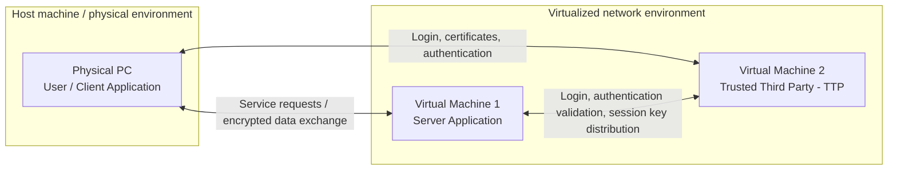
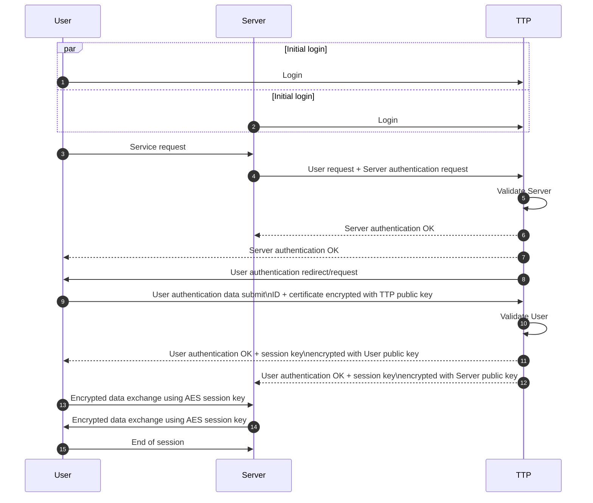
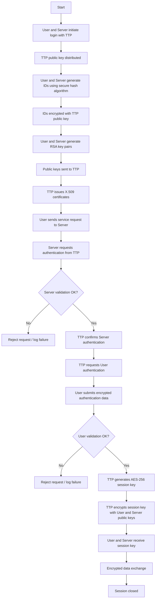
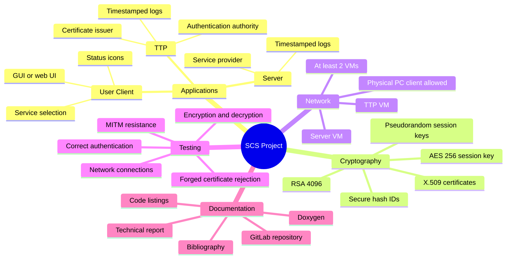

# Security of Computer Systems - Project

**Course:** BSK / SCS - Bezpieczenstwo Systemow Komputerowych / Security of Computer Systems  
**Project:** Emulating environment with Trusted Third Party and Client-Server data exchange scenario  
**Author of task:** Piotr Rajchowski  
**Version:** 1.10  
**Place and date:** Gdansk, 23.02.2026

---

## 1. Goal and Rules of Project Classes

The main goal of the project is to implement a set of applications that emulate an environment with:

- a **Trusted Third Party (TTP)**,
- a **Server**,
- a **User / Client**.

The system must demonstrate a realistic application scenario, including:

- user authentication,
- server authentication,
- service access,
- encrypted client-server data exchange.

The project is evaluated out of **40 points**:

| Assessment item | Points |
|---|---:|
| Correct realization of the project before the deadline and presentation during submission | 20 |
| Technical report | 15 |
| Presentation of the initial stage during the control meeting | 5 |
| **Total** | **40** |

Each student must select the project group on the **eNauczanie** platform. Skipping this step results in **0 points from the control meeting**.

---

## 2. Project Task

The project requires designing and developing applications that emulate an environment with:

- **User** - requests and uses a service,
- **Server** - provides a service, for example a web service or data transfer,
- **Trusted Third Party (TTP)** - authenticates both User and Server.

At least **two virtual machines** must be created. The most suitable VM allocation is:

- one VM for the **Server**,
- one VM for the **TTP**.

The User application may run on the physical host computer.

### 2.1 Environment Architecture



---

## 3. General Usage Scenario

Before any communication occurs between the User and the Server, both entities must register or log in to the TTP.

### 3.1 Login and Registration Phase

1. The **User** and **Server** generate their IDs.
2. These IDs are encrypted using the **TTP public key**.
3. The encrypted IDs are sent to the **TTP**.
4. The User and Server each generate **two RSA key pairs**.
5. The public keys are sent to the **TTP**.
6. Each entity receives its own **X.509 public key certificate** from the TTP.

### 3.2 Service Request and Authentication Phase

1. The User sends a service request to the Server.
2. The Server forwards the User request to the TTP.
3. The Server asks the TTP to authenticate the Server.
4. The TTP validates the Server request.
5. If validation is successful, the TTP informs both Server and User that the Server has been correctly authenticated.
6. The TTP requests User authentication.
7. The User responds with its generated ID and public key certificate, encrypted using the TTP public key.
8. The TTP validates the User response.
9. If validation is successful, the TTP sends an OK response to both User and Server.
10. The TTP includes the session key encrypted with the relevant public keys.

### 3.3 Data Exchange Phase

After User and Server are authenticated and have a valid session key:

1. The requested service starts.
2. User and Server exchange encrypted data using the session key.
3. After the service is complete, the session is closed.
4. Each new service request repeats the authentication process.

### 3.4 Authentication and Data Exchange Sequence



---

## 4. Cryptographic and Technical Requirements

### 4.1 Required Cryptographic Mechanisms

| Requirement | Specification |
|---|---|
| Asymmetric encryption | RSA |
| RSA key length | 4096 bits |
| Public key certificates | X.509 certificates |
| Session key generation | Pseudorandom generator |
| Symmetric encryption | AES |
| AES key length | 256 bits |
| Public ID generation | Secure hash algorithm |

### 4.2 Required Application Components

The system must include **three independent applications**:

1. User / Client application,
2. Server application,
3. TTP application.

The client application should preferably include a **GUI** that allows service selection after initial authentication. A web application is also allowed.

### 4.3 Logging and Status Requirements

The applications must implement:

- status or message icons showing application state, for example:
  - correct authentication,
  - connection to server,
  - validation result,
  - session state;
- timestamped logs for:
  - Server application,
  - TTP application.

### 4.4 Implementation Constraints

- Only one User is expected.
- The system does not need to demonstrate multi-user support.
- Existing AES, RSA, and SHA libraries may be used.
- Cipher parameters may be implemented as constants in each application, including:
  - algorithm type,
  - key size,
  - block size,
  - cipher mode.
- Any programming language and technology platform may be used.

---

## 5. Security Flow Overview



---

## 6. Report Requirements

The final report must include:

- description of the realized task,
- description of key application functionality,
- selected code fragments as listings,
- short and substantive descriptions of the listed code,
- test description, including for example:
  - authentication validation,
  - sample attacks or security tests,
  - encryption and decryption of transferred data,
  - network connection tests,
- bibliography,
- Doxygen-generated documentation.

The full code documentation must be generated using **Doxygen**.

---

## 7. GitLab Repository Requirements

All project development steps must use the University's GitLab repository:

```text
https://git.pg.edu.pl
```

The repository name must follow this pattern:

```text
SCS_GN0000_Surname1_Surname2
```

where `GN0000` is the project group name, for example:

```text
SCS_MO1213_Kowalski_Nowak
```

After creating the project repository, the teacher must be invited as **Maintainer**.

The `.gitignore` file should be modified to prevent temporary compilation files from being committed.

No ZIP archive is allowed for final code submission.

---

## 8. Project Submission and Presentation Rules

### 8.1 Control Meeting

During the control meeting, each project group presents current progress.

Attendance is obligatory for all students in the project group.

### 8.2 Final Submission

During final submission, each project group must:

1. present the project realization,
2. show the application,
3. demonstrate implemented functionality,
4. submit the report after the presentation.

Attendance is obligatory for all students in the project group.

Dates for the control meeting and final project presentation are published on the **eNauczanie** platform.

Only one submission date is planned. If the project receives an insufficient number of points for a positive mark, a second submission date may be proposed. In that case, a maximum of **60% of the total points** can be obtained.

---

## 9. Detailed Evaluation Criteria

### 9.1 Project Submission - Presentation During Classes

| No. | Task | Points |
|---:|---|---:|
| 1 | Generation of public key certificates, session keys, correct user authentication, existence of three independent applications, implementation of application logs | 4 |
| 2 | Creation of network environment with at least two virtual machines, for example TTP and Server | 5 |
| 3 | Demonstration of correct implementation of assumed project functionality, including user-server authentication with TTP and client-server data transfer | 5 |
| 4 | Presentation of correct and incorrect authentication validation when a certificate is forged by an attacker; demonstration of resistance to man-in-the-middle attack | 6 |
| | **Subtotal** | **20** |

### 9.2 Control Meeting - Partial Report and Presentation

| Requirement | Points |
|---|---:|
| Partial report / presentation during control meeting, including code and presentation during classes | 5 |

Minimum requirements:

| Item | Points |
|---|---:|
| Presentation, for example certificate generation, authentication of two identities, and basic version of client/server/TTP applications | 3 |
| Code in University's GitLab repository shared with the teacher | 2 |

Sending a one-page description/report on eNauczanie is not obligatory.

### 9.3 Final Project Report

| Requirement | Points |
|---|---:|
| Description of realized task | 4 |
| Description of key application functionality with code fragments as listings | 3 |
| Code documentation using Doxygen | 3 |
| Bibliography | 2 |
| Code in University GitLab repository shared with the teacher; ZIP archive is not allowed | 3 |
| **Subtotal** | **15** |

---

## 10. Suggested Implementation Checklist



---

## 11. Minimal Deliverables

A complete project submission should contain:

- three independent applications:
  - User / Client,
  - Server,
  - TTP;
- at least two virtual machines;
- RSA 4096-bit key generation;
- X.509 certificate generation and validation;
- secure User and Server ID generation;
- AES-256 session key generation;
- encrypted client-server data exchange;
- status icons or messages in the application interface;
- timestamped logs for Server and TTP;
- demonstration of correct authentication;
- demonstration of incorrect validation with forged certificate;
- demonstration of resistance to man-in-the-middle attack;
- GitLab repository shared with the teacher as Maintainer;
- Doxygen documentation;
- final technical report with bibliography.
