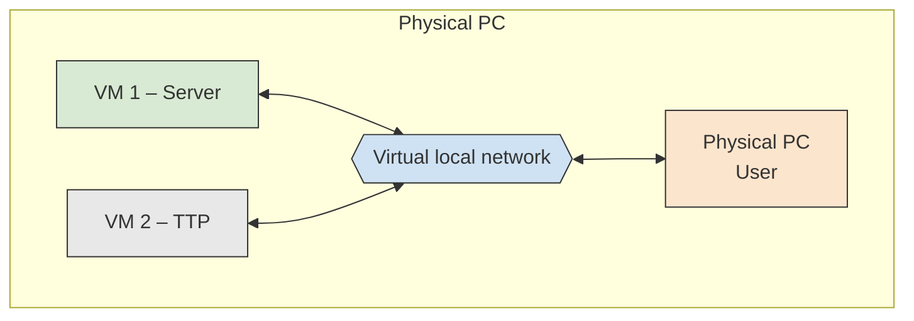
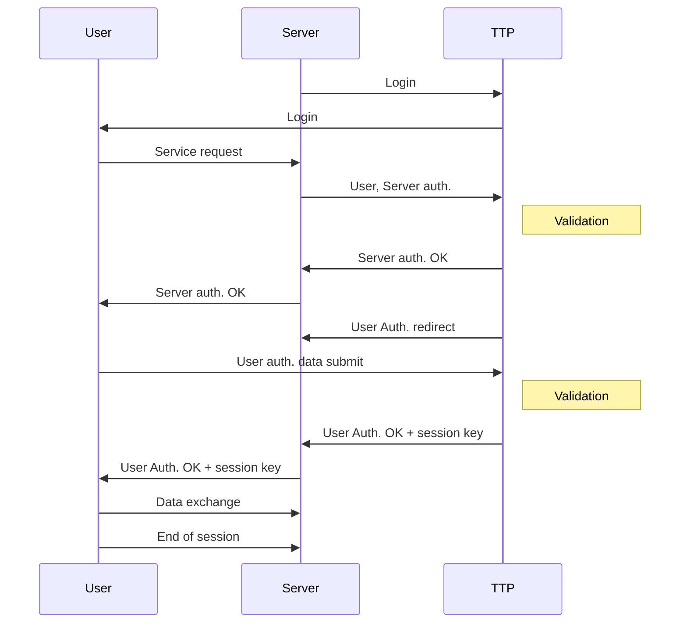

# Bezpieczeństwo Systemów Komputerowych – Projekt

# Security of Computer Systems – Project

**Emulating environment with Trusted Third Party and Client-Server data exchange scenario**

Piotr Rajchowski

Version 1.10, Gdańsk, 23.02.2026

_Gdańsk University of Technology — Faculty of Electronics, Telecommunications and Informatics_

---

## 1. The goal and rules of project classes

The main goal of the project is to realize a set of applications for emulating environment with trusted third party (TTP), server and client. The goal is to demonstrate the real application scenario, including user authentication and service access.

The project is evaluated according to the following rules (**40 points in total**):

- Correct realization of the project before the deadline, presentation during submission – **20 points**
- Technical report – **15 points**
- Presentation the initial stage of project realization (during control meeting) – **5 points** (all dates are published in schedule)

The details of project evaluation are described in Section 3 and presented in Tab. 1.

> ⚠️ **Each student _must_ select the project group on the eNauczanie platform. Skipping this step will result in assigning zero points from the control meeting.**

---

## 2. Project tasks

The main goal of the project is to design and develop a set of applications emulating environment with **User**, **Server** that provides a service (e.g. web service, data transfer) and **Trusted Third Party (TTP)** that authenticates the User and Server. It is assumed that the communication will emulate the real scenario so **at least two virtual machines (VM)** must be created (most suitable Server and TTP). The User's application can be executed from a physical computer. The concept of environment organization is presented in Fig. 1.

### Fig. 1 – Block diagram of emulated environment with physical PC and two VMs

_Fig. 1 – Block diagram of emulated environment with physical PC and two VMs._

### General usage scenario

Before any communication appears between User and Server, each must register / login to the TTP. User and Server generate their IDs and encrypt them with TTP's public key and then send them to TTP. Moreover, User and Server generate two pairs of RSA keys and send the public keys to the TTP. After this process each of them obtains from TTP its X.509 public key certificate.

When User wants to use a service provided by the server (e.g. web service, data transfer) it sends a request to the Server. Server forwards the User's request to TTP and sends a request for Server authentication.

TTP validates the Server's request, after a positive decision sends to Server and User information that Server was correctly authenticated. After that, TTP sends to User a request for User authentication. User responds using, in the process, its generated ID (and public key certificate) encrypted with TTP's public key.

TTP validates the response from User; if the validation is positive, it sends an OK response to User and Server, including the session key (encrypted with their public keys).

User and Server are authenticated and have a valid session key, so the requested service can be started. From now on, the encrypted data (using the session key) are exchanged between User and Server. After finishing the process, the session is closed. The next service request repeats the authentication process.

> **Note:**
>
> - The TTP public key can be sent to User / Server just after the login phase was initiated.
> - The public User's and Server's IDs must be generated using a secure hash algorithm.

The described concept is illustrated in Fig. 2.

### Fig. 2 – Illustration of data exchange between User, Server and TTP

_Fig. 2 – Illustration of data exchange between User, Server and TTP._

### Key requirements

- It is advised to create the client's application with a **GUI interface** that will allow a selection of a service after initial authentication (or a web application).
- The **RSA algorithm with a 4096-length key** must be used.
- A **pseudorandom generator** must be used to generate the session keys.
- For the session key the **AES algorithm** should be used, with a **256-bit length key**.
- **Status/message icons** presenting the state of the application (e.g. correct authentication, connection to server) must be implemented. Moreover, **Server and TTP applications must save their logs with timestamps**.
- It is assumed that **only one User** is expected; there is no need to demonstrate the functionality for more users.
- It is allowed to use the available libraries of the AES, RSA, SHA algorithms.
- The parameters of the cipher (algorithm type, key size, block size, cipher mode) can be set as constants in each application.
- **Any programming language and technology platform** can be used to develop the applications.
- In the report, a **brief description of performed tests** must be included (e.g. authentication validation, sample attacks/tests, encryption/decryption of transferred data, network connections).
- In the report the **code of the application must be partially included in the form of listings**, pointing out the main functions of the application. A short and substantive description must be provided.
- The **full code documentation must be created using the Doxygen documentation generator**.
- **Important:** It is obligatory to develop all projects (every step of development) using the **University's GitLab repository** (https://git.pg.edu.pl). The repository must be named using the pattern `[SCS_GN0000_Surname1_Surname2]` where `GN0000` is the name of the project group (e.g. `MO1213`). When the project is created, the teacher must be invited as **"Maintainer"** to check the code during project presentation and submission. It is strongly advised to modify the `.gitignore` file to prevent all temporary files created during project compilation from being committed to the repository.

---

## 3. Project submission and presentation rules

During the **control meeting** each project group (the presence is obligatory for all students in the project group) shows current progress in project realization. Details are presented in Tab. 1.

During **final submission** each group (the presence is obligatory for all students in the project group) presents the project realization, showing the application and implemented functionality. After the project presentation each group submits a report. Details are presented in Tab. 1.

Dates for the control meeting and final project presentation are published on the eNauczanie platform.

Only **one submission date** is planned. In case of obtaining an insufficient number of points to obtain a positive mark from the project classes, a **2nd date for submission** of the project is proposed, but in that case only **60% of points in total** can be obtained.

### Tab. 1 – Detailed project evaluation

#### PROJECT SUBMISSION – Presentation during classes

| #   | Task                                                                                                                                                                          | Points |
| --- | ----------------------------------------------------------------------------------------------------------------------------------------------------------------------------- | ------ |
| 1   | Generation of public key certificates, session keys, correct user authentication (existence of three independent applications), implementation of application's logs.         | 4      |
| 2   | Creation of network environment with at least 2 virtual machines (e.g. TTP and Server).                                                                                       | 5      |
| 3   | Demonstration of correct implementation of assumed project functionality (i.e. correct authentication of user-server with involved TTP, data transfer between client-server). | 5      |
| 4   | Presentation of correct and incorrect validation of authentication when the certificate was forged by attacker (pointing out resistance to man-in-the-middle attack).         | 6      |

#### REPORTS – The report is evaluated only after project presentation

| #   | Task                                                                                                   | Points |
| --- | ------------------------------------------------------------------------------------------------------ | ------ |
| 6   | **Partial report (presentation only) for the control meeting** (+ code, + presentation during classes) | 5      |
| 7   | **Project report** (+ code, + University GIT repository, + pointing bibliography in the report)        | 15     |

**Item 6 — Minimal requirements:**

- Presentation: e.g. possibility of certificate generation, authentication of two identities; basic version of client / server / TTP applications **(3 points)**.
- Code in University's GitLab repository shared with teacher **(2 points)**.
- Sending a 1-page description/report on eNauczanie platform is not obligatory.

**Item 7 — Project report breakdown:**

- Description of realised task **(4 points)**.
- Description of key application functionality, pointing out code fragments as listings **(3 points)**.
- Code documentation using Doxygen **(3 points)**.
- Pointing out the bibliography **(2 points)**.
- Code in University's GitLab repository shared with teacher (no `*.zip` archive allowed) **(3 points)**.
