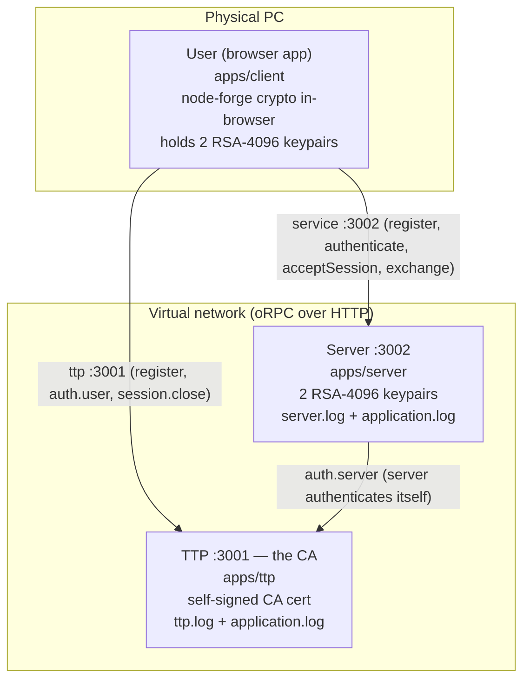
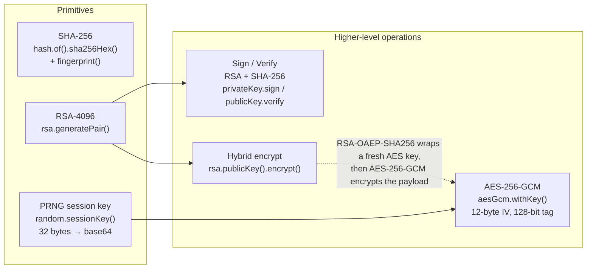
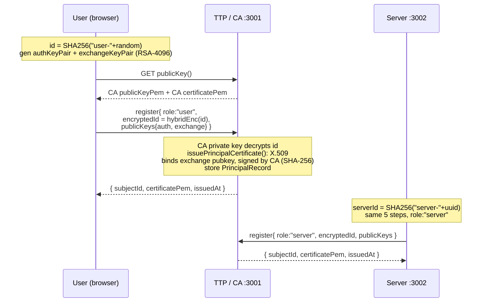
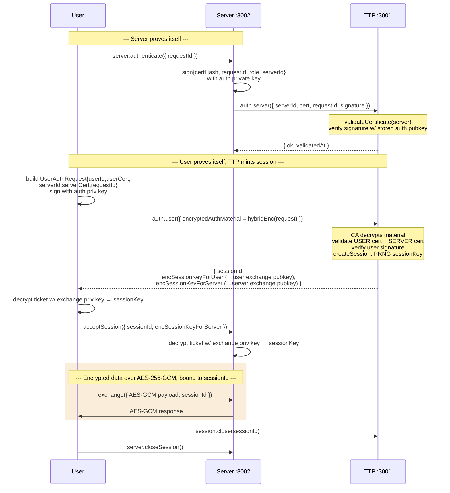
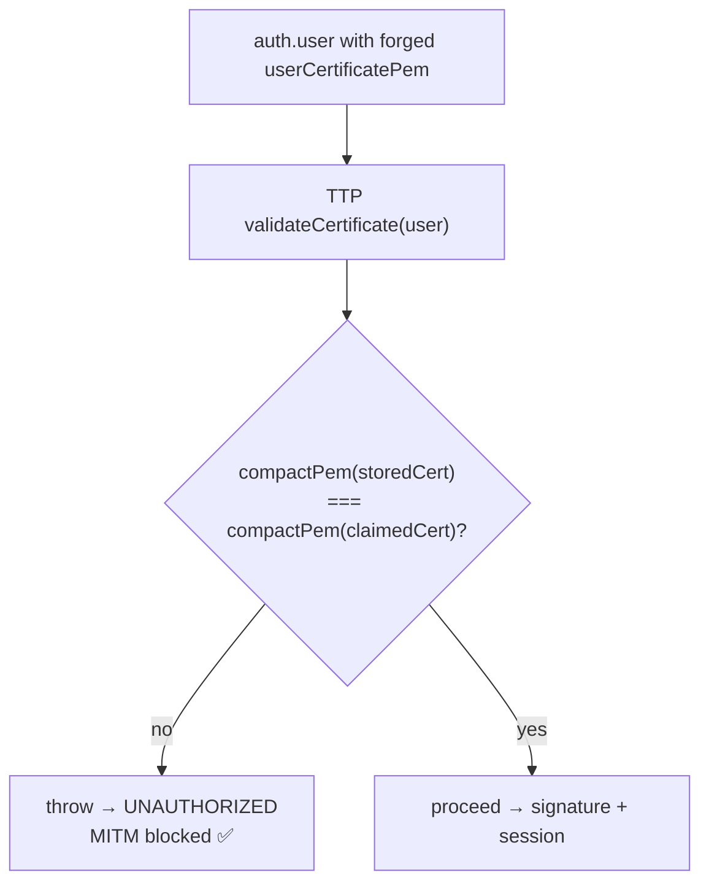

# SCS — actual implemented protocol & security map

> This documents what the code **actually does**, derived from reading the repo
> (not the idealized `SCS_protocol_overview.md`). Where the implementation diverges
> from the overview, it is flagged explicitly.

A **Bun + TypeScript monorepo**, three apps + two shared packages, talking over
**oRPC** (typed RPC over HTTP/fetch).

| Component | Path | Port | Role |
|---|---|---|---|
| **User** | `apps/client/` | browser (Vite) | React GUI; does its own RSA/AES in-browser via node-forge |
| **Server** | `apps/server/` | 3002 | The protected service |
| **TTP** | `apps/ttp/` | 3001 | Certificate Authority + session-key issuer |
| `@bsk/crypto` | `packages/crypto/` | — | All primitives (node-forge) |
| `@bsk/rpc` | `packages/rpc/` | — | oRPC transport + pino timestamped logging |

---

## 1. Deployment / trust topology

**Key structural fact the overview omits:** every principal (User and Server) holds
**two** RSA-4096 keypairs, not one:

- **`authKeyPair`** → used only for *signing* (proof of private-key possession).
- **`exchangeKeyPair`** → its public key is what the X.509 cert binds, and what the
  session key is encrypted to.

---

## 2. Crypto building blocks (`packages/crypto/src/crypto.ts`)

**Notable:** `rsa.publicKey().encrypt()` is **not** plain RSA — it is a full
**hybrid/envelope scheme** (exactly like TLS): generate a fresh AES-256 key,
AES-GCM-encrypt the plaintext, RSA-OAEP-SHA256-wrap the AES key, and ship both. So
registration IDs, auth material, and session tickets are all hybrid-encrypted and not
size-limited by RSA.

---

## 3. Phase 1 — Enrollment / Registration

Issued certs (`certificates.ts`) get proper X.509 extensions: `clientAuth` extKeyUsage
for users, `serverAuth` for servers, a `subjectAltName` URN, and 30-day validity.

---

## 4. Phase 2 — Authenticated session (the core flow, as actually coded)

Spans `apps/client/src/lib/security-flow.ts` + `apps/ttp/src/protocol.ts` +
`apps/server/src/protocol.ts`.

The session key is **never sent in clear** — the TTP RSA-wraps it twice, once per
party's *exchange* public key. AES payloads carry the `sessionId`, and `forSession()`
refuses any payload whose `sessionId` doesn't match.

---

## 5. The MITM / forged-certificate demo — satisfies Task 4

`verifyForgedCertificateIsRejected()` (`security-flow.ts`) sends a user-auth request
where the user's cert is swapped for the **server's** cert (a mismatched/forged claim):

**This is in spec.** The task PDF (Task 4) requires only a *behavioral* outcome:
*"correct and incorrect validation of authentication when the certificate was forged by
attacker (pointing out resistance to man-in-the-middle attack)."* It does **not** mandate
any particular validation mechanism.

The implementation rejects forgeries by a **stored-PEM lookup**: the TTP compares the
presented cert, whitespace-stripped, against the cert it issued and stored at registration
(`compactPem(record.certificatePem) !== compactPem(claim.certificatePem)` in
`apps/ttp/src/certificates.ts`). An attacker's forged cert is not the one the TTP issued,
so it is rejected — the MITM is blocked. This is a legitimate detection mechanism and
fully satisfies Task 4.

> **Report wording (be accurate):** describe this as *"the TTP rejects any certificate that
> does not match the one it issued during registration"* — **not** as cryptographic CA-signature
> re-verification, which the code does not do. If a grader asks "how is the forgery caught?",
> the honest answer is "the TTP does not recognize it as a certificate it issued." No code
> change is required to conform to the PDF.

---

## 6. Security goals → actual mechanism

| Goal | PDF requires | Implemented as | Where |
|---|---|---|---|
| **Authentication** | X.509 cert + RSA-4096; two RSA key pairs per principal | X.509 cert issued by CA **+** RSA/SHA-256 signature over a request payload (proof of `authKeyPair` possession), checked by `verifyPrincipalSignature`. Cert validation = stored-PEM equality (see §5, in spec). | `ttp/protocol.ts`, `ttp/certificates.ts` |
| **Confidentiality** | AES-256 (session) + RSA (key transport) | AES-**256-GCM** for data; **hybrid RSA-OAEP-SHA256 + AES-GCM** for id/auth-material/session-ticket transport | `crypto.ts` |
| **Integrity** | SHA-256 | SHA-256 in signed payloads & cert hashes; **AES-GCM auth tag**; RSA signatures | throughout |
| **Freshness** | PRNG session key | `random.sessionKey()` per session **+** `requestId` (UUID) nonce inside every signed payload | `crypto.ts`, `ttp/protocol.ts` |

Logs are timestamped via pino to `logs/ttp.log`, `logs/server.log`, and a shared
`application.log` (`packages/rpc/src/log.ts`) — satisfying the "timestamped logs on
Server and TTP" deliverable.

---

## Summary

A working hybrid-PKI handshake that mirrors TLS — TTP-as-CA enrollment, mutual
authentication via cert + signature, RSA-wrapped PRNG session keys, and authenticated
AES-256-GCM bulk encryption — with a forged-cert rejection demo.

Two design points that this document earlier mis-framed as "deviations" — they are not;
they match the **task PDF** (the divergence was only from the simplified
`SCS_protocol_overview.md`):

1. **Two keypairs per principal** (auth vs. exchange). The PDF says verbatim *"User and
   Server generate two pair of RSA keys"* — so the split is the **literal, required**
   reading. The overview doc collapsing it to one key was the inaccurate document.
2. **Cert validation is a stored-PEM lookup.** The PDF specifies no validation mechanism;
   Task 4 only requires that a forged cert be rejected and the MITM blocked, which the
   lookup does. **In spec.** The only obligation is to describe it accurately in the report
   (see §5).
