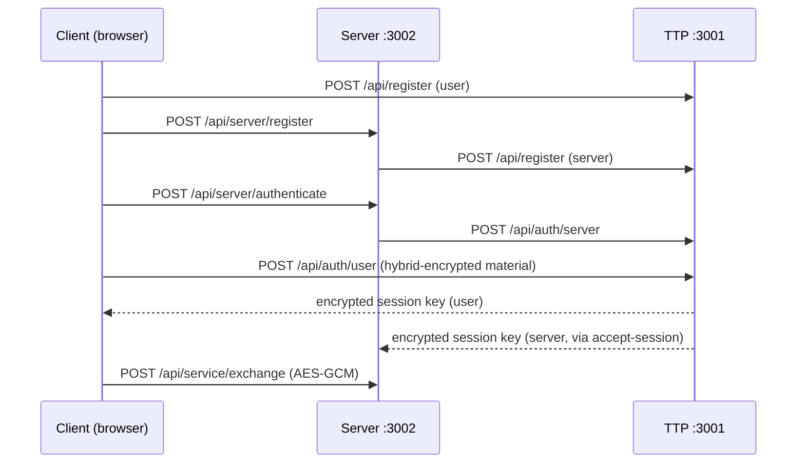

# Security Demo Audit: Issues, Findings, and Fixes

This document records the hands-on audit of the BSK PG three-application Trusted Third Party (TTP) demo (Client, protected Server, TTP), including problems discovered, changes implemented, and known limitations left intentionally for the course demo.

**Related pull request:** [PR #3 — Fix demo lifecycle gaps found in manual audit](https://github.com/VV01T3K/BSK_PG/pull/3)

**Branch:** `cursor/audit-improvements-8148`

---

## 1. Scope and methodology

### What was reviewed

| Layer | Location | Focus |
|-------|----------|--------|
| TTP API | `apps/ttp/` | Registration, certificate validation, session keys, reset |
| Protected Server API | `apps/server/` | Registration proxy, session acceptance, AES-GCM exchange |
| Client demo | `apps/client/src/demo/` | Browser crypto, orchestration, attack scenarios |
| UI | `apps/client/src/routes/_guard/` | Demo flow, health display, error handling |
| Tests | `**/*.test.ts` | Coverage gaps |
| Ops | `docker-compose.yml`, `docs/demo-checklist.md` | Runnable demo path |

### How it was tested

1. **Automated pipeline** — `bun run ready` (typecheck, Vitest, production build).
2. **Repeated test runs** — Three consecutive `bun run test` passes to check flakiness.
3. **In-process integration** — Client tests mock `fetch` to hit in-memory Hono apps (no network).
4. **Live dev servers** — `bun run dev` on ports 3000 (client), 3001 (TTP), 3002 (server).
5. **Manual API probes** — Invalid roles, malformed auth payloads, exchange without session, reset health counts.
6. **Code review** — Duplication, unused fields, lifecycle edge cases.

Docker Compose was **not** verified in the cloud agent environment (Docker daemon could not start due to host `iptables` limits). Validate locally with `docker compose up --build`.

---

## 2. Architecture recap (for context)



State is **in-memory only** in each process. There is no shared database.

---

## 3. Issues found and status

### 3.1 Fixed in PR #3

#### F1 — Reset did not clear TTP state

| | |
|---|---|
| **Symptom** | After using **Reset** in the UI, the TTP health card still showed non-zero **Principals** and **Sessions**. |
| **Cause** | `resetSecurityDemo()` cleared client state and called `POST /api/reset` on the Server only. The TTP kept all `principals` and `sessions` Maps. |
| **Impact** | Misleading demo metrics; orphan principals after repeated runs. |
| **Fix** | Added `POST /api/reset` on the TTP (`apps/ttp/src/routes.ts`). Client Reset now calls TTP reset, then server reset, then clears browser state. |
| **Files** | `apps/ttp/src/routes.ts`, `apps/client/src/demo/actions.ts` |

#### F2 — Re-register without Reset accumulated TTP principals

| | |
|---|---|
| **Symptom** | Clicking **Register roles** again without **Reset** registered new user/server IDs while old TTP entries remained. |
| **Cause** | `registerSecurityDemoRoles()` overwrote local client/server state but never cleared the TTP. |
| **Impact** | `registeredPrincipals` grew on every re-registration; confusing for presentations. |
| **Fix** | `registerSecurityDemoRoles()` calls `resetSecurityDemo()` first when a user or server is already registered. |
| **Files** | `apps/client/src/demo/actions.ts` |

#### F3 — Session expiry was stored but not enforced

| | |
|---|---|
| **Symptom** | TTP returns `expiresAt` (15-minute TTL) and the UI displays it, but encrypted exchange still worked after expiry if keys were still in memory. |
| **Cause** | `requireSessionKey()` on the Server and `requireSession()` on the Client only checked presence of keys, not `expiresAt`. |
| **Impact** | Demo implied time-bounded sessions without enforcing them. |
| **Fix** | Server: `assertSessionNotExpired()` in `requireSessionKey()`. Client: expiry check in `requireSession()`. |
| **Files** | `apps/server/src/state.ts`, `apps/client/src/demo/state.ts` |

#### F4 — MITM tamper demo was unrealistic

| | |
|---|---|
| **Symptom** | **Tamper** appended `.` to the base64 ciphertext string. |
| **Cause** | Ad-hoc string manipulation in `runMitmTamperAttack()`. |
| **Impact** | GCM still failed, but the attack did not resemble in-transit bit corruption. |
| **Fix** | Added `tamperEnvelope()` in `browser-crypto.ts` — decodes ciphertext, XORs one byte, re-encodes. |
| **Files** | `apps/client/src/demo/browser-crypto.ts`, `apps/client/src/demo/actions.ts` |

#### F5 — Server state refresh failures were silent

| | |
|---|---|
| **Symptom** | UI could show stale registration/session data when the Server was down. |
| **Cause** | `getSecurityDemoState()` used `.catch(() => undefined)` on `refreshServerState()`. |
| **Impact** | No user-visible hint that Server sync failed. |
| **Fix** | Catch logs a warning entry to the demo event log instead of swallowing silently. |
| **Files** | `apps/client/src/demo/actions.ts` |

#### F6 — Duplicate type definitions (client vs server)

| | |
|---|---|
| **Symptom** | `EncryptedEnvelope` and `ServiceServerSnapshot` were copy-pasted in `apps/client/src/demo/types.ts` and `apps/server/src/types.ts`. |
| **Cause** | No shared types package; client duplicated server shapes. |
| **Impact** | Risk of drift if one package changes fields. |
| **Fix** | Client `types.ts` re-exports `EncryptedEnvelope` and `ServiceServerSnapshot` from the `server` workspace. |
| **Files** | `apps/client/src/demo/types.ts` |

#### F7 — Missing automated test coverage

| | |
|---|---|
| **Symptom** | Server package used `vitest run --passWithNoTests`; integration test omitted close/reset/TTP health. |
| **Cause** | Tests focused on TTP and client crypto only. |
| **Impact** | Server route regressions (session mismatch, expiry) were untested. |
| **Fix** | See [Section 4 — Test changes](#4-test-changes). |
| **Files** | `apps/server/src/routes.test.ts`, extended `actions.test.ts`, `index.test.ts`, `browser-crypto.test.ts` |

---

### 3.2 Known limitations (not changed — intentional for demo)

These were identified during the audit and **left as-is** because they match the course demo scope or would require protocol/UI redesign.

| ID | Issue | Location | Rationale |
|----|-------|----------|-----------|
| L1 | **`authPublicKeyPem` is never used** | Registration in client, server, TTP types | UI describes “two RSA-4096 key pairs”; only `exchangePublicKeyPem` is bound to certificates and session-key wrapping. Removing it would simplify the model but change the presentation story. |
| L2 | **No `requestId` binding on TTP** | `POST /api/auth/server` vs `POST /api/auth/user` | Server auth does not record `requestId`; user auth does not verify the server was authenticated for the same `requestId`. Acceptable for a linear demo script. |
| L3 | **TTP session close vs server session close are separate** | `closeSecurityDemoSession()` | Server can still decrypt if only TTP closed and local keys remain — UI calls both endpoints. |
| L4 | **Open CORS (`*`) and unauthenticated reset** | TTP and Server routes | Fine for localhost demo; not production-hardening. |
| L5 | **In-memory state / no persistence** | All apps | Browser refresh loses user private keys; Server/TTP may still hold old principals until Reset. |
| L6 | **Server `expiresAt` is client-supplied on accept-session** | `POST /api/server/accept-session` | Server trusts `expiresAt` from the client demo flow rather than re-fetching from TTP. |
| L7 | **TTP `closedAt` not checked on new operations** | `sessions` Map | Closing a session on TTP does not block a new `auth/user` for the same principals; only relevant if API is used outside the UI script. |
| L8 | **Forged cert attack swaps certificates** | `runForgedCertificateAttack()` | Demonstrates wrong cert for user ID (binding), not a signature forgery. Sufficient for “TTP rejects bad cert” narrative. |

---

### 3.3 Suggested future improvements (not implemented)

| ID | Suggestion | Benefit |
|----|------------|---------|
| R1 | Remove `authPublicKeyPem` from `PublicKeySet` and registration flows | Smaller API; less confusion |
| R2 | Shared `packages/demo-types` or `packages/rpc` for `parseRpcResponse` | One implementation of RPC error parsing |
| R3 | TTP tracks validated `requestId` and user auth must match | Stronger mutual-auth story |
| R4 | Server rejects exchange when TTP session is `closedAt` (TTP callback or shared session store) | End-to-end session lifecycle |
| R5 | Structured error codes (`{ code, message }`) | Cleaner UI error handling |
| R6 | `packages/crypto` for RSA/hybrid/AES helpers | Less duplication between Node and Web Crypto paths |
| R7 | Authenticate or restrict `POST /api/reset` in non-demo deployments | Safety if ever exposed |

---

## 4. Changes made (summary)

### 4.1 API changes

| Service | Endpoint | Change |
|---------|----------|--------|
| TTP | `POST /api/reset` | **New.** Clears principals, sessions, and logs. Returns `{ ok, registeredPrincipals: 0, activeSessions: 0 }`. |

Existing Server `POST /api/reset` unchanged; Client Reset now invokes **both** resets.

### 4.2 Client demo behavior

| Function | Before | After |
|----------|--------|-------|
| `resetSecurityDemo()` | Client + Server only | Client + Server + **TTP** |
| `registerSecurityDemoRoles()` | Always register | **Auto-reset** if roles already registered |
| `getSecurityDemoState()` | Silent catch on server refresh | **Logs warning** on refresh failure |
| `runMitmTamperAttack()` | Append `.` to base64 | **`tamperEnvelope()`** — flip one ciphertext byte |
| `requireSession()` | Keys present only | Also rejects **expired** sessions |

### 4.3 Server behavior

| Function | Before | After |
|----------|--------|-------|
| `requireSessionKey()` | Keys present only | Also rejects **expired** sessions via `assertSessionNotExpired()` |

### 4.4 Types

- `apps/client/src/demo/types.ts` — re-exports `EncryptedEnvelope`, `ServiceServerSnapshot` from `server` workspace.

### 4.5 Test changes

| Package | Tests before | Tests after | New / extended coverage |
|---------|--------------|-------------|------------------------|
| `apps/client` | 4 | 5 | `tamperEnvelope`; close session; reset clears TTP health |
| `apps/server` | 0 (passWithNoTests) | 5 | No session exchange; accept-session mismatch; session id mismatch; expired session; reset |
| `apps/ttp` | 4 | 5 | `POST /api/reset` clears health metrics |
| **Total** | **8** | **15** | |

Server tests mock `fetch` to route `localhost:3001` to the in-process TTP app (same pattern as client integration tests).

---

## 5. File change index

| File | Change type | Description |
|------|-------------|-------------|
| `apps/ttp/src/routes.ts` | Modified | Added `POST /api/reset` |
| `apps/ttp/src/index.test.ts` | Modified | Test for TTP reset + health |
| `apps/server/src/state.ts` | Modified | Session expiry enforcement |
| `apps/server/src/routes.test.ts` | **New** | Server route edge-case tests |
| `apps/client/src/demo/actions.ts` | Modified | TTP reset, auto-reset on re-register, tamper, refresh logging |
| `apps/client/src/demo/state.ts` | Modified | Session expiry in `requireSession()` |
| `apps/client/src/demo/types.ts` | Modified | Re-export types from `server` |
| `apps/client/src/demo/browser-crypto.ts` | Modified | Added `tamperEnvelope()` |
| `apps/client/src/demo/actions.test.ts` | Modified | Close, reset, TTP health assertions |
| `apps/client/src/demo/browser-crypto.test.ts` | Modified | Tamper helper test |

---

## 6. Verification checklist

Use this after pulling the audit branch or merging PR #3:

```bash
bun install
bun run ready          # typecheck + 15 tests + build
bun run dev            # start all three apps
```

Manual UI flow (`docs/demo-checklist.md`):

1. **Register roles** — User and Server IDs and fingerprints appear.
2. **Start session** — Session ID and expiry appear; TTP health shows principals/sessions.
3. **Exchange data** — Plaintext evidence and AES-GCM envelopes appear.
4. **Forged cert** — TTP rejects (attack result green).
5. **Tamper** — Server rejects (GCM auth failure).
6. **Close session** — Session cleared locally.
7. **Reset** — TTP health **Principals** and **Sessions** return to **0**.

Optional API checks:

```bash
curl -s http://localhost:3001/api/health
curl -s -X POST http://localhost:3001/api/reset
curl -s http://localhost:3001/api/health   # expect registeredPrincipals: 0
```

Docker (local machine with working Docker):

```bash
docker compose up --build
```

---

## 7. References

- Demo steps: `docs/demo-checklist.md`
- Implementation roadmap: `docs/implementation-roadmap.md`
- Root README: `README.md`

---

*Document generated from the May 2026 security demo audit. Update this file if further lifecycle or protocol changes are merged.*
