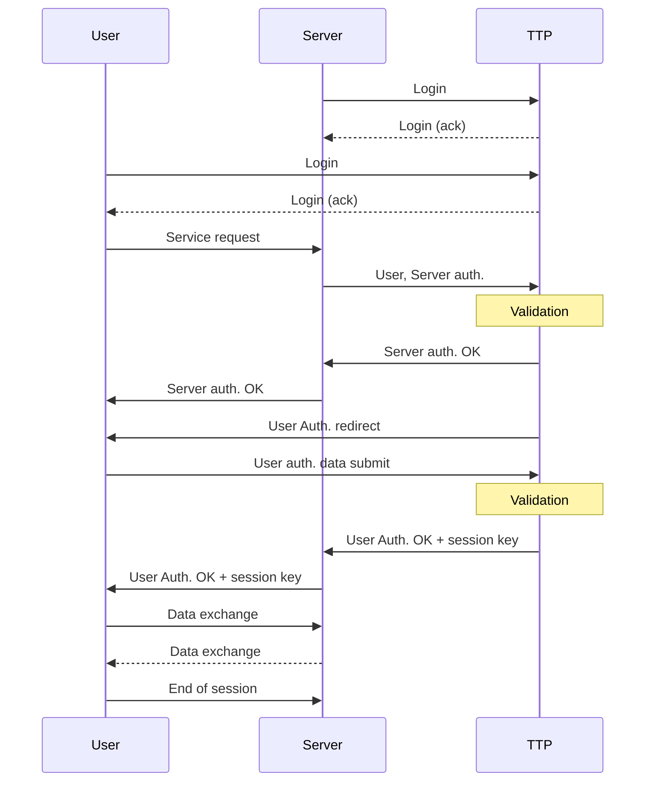

# SCS — conformance & differences vs. the task PDF

> What the **code actually does** vs. the requirements. **What is normative:** the task
> PDF prose (`docs/SCS_2026_project_task.md` §2) and the Tab. 1 task list. Fig. 2 is
> labelled *"Illustration of data exchange"* — illustrative, not a strict message-order
> contract. `SCS_protocol_overview.md` was a **simplified secondary writeup** and is **not
> authoritative**; several items earlier flagged as "deviations" were only deviations from
> that overview, not from the PDF — they are corrected below.
>
> **Bottom line: the implementation conforms to the PDF.** The remaining items are either
> (a) illustrative-figure differences that the PDF prose already permits, (b) deployment
> tasks to confirm at demo time, or (c) optional hardening beyond what the PDF requires.
>
> Severity legend: 🟠 confirm/decide before demo · 🟡 describe accurately in the report ·
> 🟢 intentional improvement, in spec · ✅ conforms, no action.

---

## A. Protocol message-flow deviations (official Fig. 2 vs. code)

### Target flow — faithful reproduction of Fig. 2

Reading the arrows precisely, Fig. 2 is **mixed**, not purely Server-relayed:

- **Direct User↔TTP** for: `Login`, `User Auth. redirect`, and `User auth. data submit`.
- **Server-relayed** for: `User, Server auth.` (Server → TTP), `Server auth. OK`
  (TTP → Server → User), and `User Auth. OK + session key` (TTP → Server → User).

This corrects an earlier claim: the User submitting auth data **directly** to the TTP is
**compliant** with Fig. 2 (step 9), so the code's direct `ttp.auth.user` call is *not* a
deviation. The genuine gap is the **session-key return path** and a few missing/relayed
framing messages.

### Message-by-message mapping (Fig. 2 → code)

| # | Fig. 2 message | Direction | Status | Code |
|---|---|---|---|---|
| 1 | Login | S ↔ T | ✅ | `registerProtectedServer` → `ttp.register` |
| 2 | Login | U ↔ T | ✅ | `registerPrincipals` → `ttpProtocol.registerUser` |
| 3 | Service request | U → S | ❌ missing | only the *encrypted* exchange exists, and it's at the end |
| 4 | User, Server auth. | S → T | ◐ partial | `ttp.auth.server` authenticates **only the Server**; user auth is a separate direct call, not relayed in this message |
| 5 | Validation | T | ✅ | `authenticateServerCertificate` |
| 6 | Server auth. OK | T → S | ✅ | `ttp.auth.server` response |
| 7 | Server auth. OK | S → U | ◐ partial | `service.server.authenticate` response returns to the User, but not modeled as a relay of the TTP message |
| 8 | User Auth. redirect | T → U | ❌ missing | no explicit redirect; the client just proceeds to call `auth.user` |
| 9 | User auth. data submit | U → T | ✅ | `ttpProtocol.authenticateUser` → `ttp.auth.user` (**direct, compliant**) |
| 10 | Validation | T | ✅ | `authenticateUserForServer` (validates user + server cert + signature) |
| 11 | User Auth. OK + session key | T → S | ❌ **reversed** | TTP returns the key to the **User**, not the Server |
| 12 | User Auth. OK + session key | S → U | ❌ **reversed** | code does U → S (`acceptSession`): the **User** hands the Server its key |
| 13 | Data exchange | U ↔ S | ✅ | `service.service.exchange` (AES-256-GCM both ways) |
| 14 | End of session | U → S | ✅ | `closeSession` + `server.closeSession` (code also notifies TTP, which Fig. 2 omits) |

### A1. 🟡 `Login` modeled as a separate enrollment phase, not in-flow messages (Fig. 2 steps 1–2)

- **Spec:** `S↔T: Login` and `U↔T: Login` shown inline at the top of the session diagram.
- **Code:** Enrollment is a distinct earlier phase (Server self-registers at startup; User
  registers from the GUI). Functionally equivalent, just not drawn as part of the session flow.
- **Where:** `apps/server/src/protocol.ts:20`, `apps/client/src/lib/security-flow.ts:19`.
- **Action:** Present enrollment as Phase 1 in the report and map "Login" to it. No code change needed.

### A2. 🟡 Session key returned to the **User** then relayed to the Server (Fig. 2 draws TTP → Server → User)

- **PDF prose (§2, normative):** *"it sends an OK response to User and Server, including the
  session key (encrypted with their public keys)."* The requirement is that **both** parties
  receive the session key encrypted under their own public key. The transport path is **not**
  pinned by the prose; Fig. 2's `T→S→U` is illustrative.
- **Code:** The TTP returns **both** encrypted session keys to the **User** in one response
  (`encryptedSessionKeyForUser` + `encryptedSessionKeyForServer`); the User forwards the server's
  copy via `service.server.acceptSession`.
- **Where:** `apps/ttp/src/protocol.ts:102-114`, `apps/client/src/lib/security-flow.ts:49-52`,
  `apps/server/src/protocol.ts:60-72`.
- **Status:** Satisfies the PDF prose (each party gets the key wrapped under its own public key).
  Differs only from the illustrative figure's relay direction. **Action:** describe the
  client-driven delivery accurately in the report, or re-route to match the figure if you want
  pixel-fidelity to Fig. 2.

### A3. 🟡 No initial `Service request` message triggers authentication (Fig. 2 step 3)

- **Spec:** `U→S: Service request` happens *first* and triggers the Server to send
  `User, Server auth.` to the TTP.
- **Code:** Authentication is driven by an explicit GUI "Authenticate" step; the only service
  request is the encrypted exchange at the **end** (`sendEncryptedServiceRequest`).
- **Where:** `apps/client/src/lib/security-flow.ts:37-69`.
- **Action:** Add a no-op/typed "service request" call that kicks off auth, or clarify ordering
  in the report.

### A4. 🟡 No `User Auth. redirect` and no relayed `Server auth. OK` (Fig. 2 steps 7–8)

- **Spec:** TTP → User `User Auth. redirect`, and `Server auth. OK` relayed TTP → Server → User.
- **Code:** There is no explicit redirect message; after the Server authenticates, the client
  proceeds straight to `auth.user`. "Server auth. OK" reaches the User as the
  `service.server.authenticate` response rather than a relayed TTP message.
- **Where:** `apps/client/src/lib/security-flow.ts:41-43`.
- **Action:** Cosmetic/framing; add the messages for fidelity or explain in the report.

---

## B. Cryptographic / mechanism notes (all in spec)

### B1. ✅ Certificate validation is a stored-PEM lookup — **in spec, not a deviation**

- **What the PDF requires (Task 4):** only the *behavioral* outcome — *"correct and incorrect
  validation of authentication when the certificate was forged by attacker (pointing out
  resistance to man-in-the-middle attack)."* No validation mechanism is mandated.
- **Code:** `validateCertificate` compares the presented PEM, whitespace-stripped, to the PEM the
  TTP issued and stored at registration. A forged cert is not the one the TTP issued, so it is
  rejected and the MITM is blocked.
- **Where:** `apps/ttp/src/certificates.ts:24-32`.
- **Status:** Satisfies Task 4. **Retraction:** an earlier version of this doc (and the
  `SCS_protocol_overview.md`) called for CA-signature re-verification — that was holding the code
  to the idealized overview, not the PDF. No code change required.
- **Report wording:** describe it accurately as *"the TTP rejects any certificate that does not
  match the one it issued during registration"* — **not** as cryptographic CA-signature
  re-verification. "The TTP doesn't recognize it as a cert it issued" is a legitimate detection
  mechanism and a complete answer to "how is the forgery caught?".

### B2. ✅ The X.509 certificate binds the exchange key; the auth key is registered with the TTP

- **What the PDF requires (§2):** *"User and Server generate two pair of RSA keys and send the
  public keys to the TTP"* and obtain an X.509 certificate. It does **not** require both keys to
  be embedded in one certificate.
- **Code:** `issuePrincipalCertificate` binds `exchangePublicKeyPem` in the cert; the
  `authPublicKeyPem` is sent to and stored by the TTP and used to verify the auth signature.
- **Where:** `apps/ttp/src/certificates.ts:15-22`, `packages/crypto/src/certificates.ts:45-72`,
  `apps/ttp/src/protocol.ts:149-155`.
- **Status:** In spec — both key pairs are generated and registered with the TTP exactly as the
  PDF says. Just describe the auth-vs-exchange split accurately in the report.

### B3. 🟢 Hybrid envelope encryption (in spec, the standard way to "encrypt with a public key")

- **What the PDF says (§2):** *"encrypt their IDs with TTP's public key."*
- **Code:** `rsa.publicKey().encrypt()` is a TLS-style hybrid: fresh AES-256-GCM key per message,
  RSA-OAEP-SHA256-wrapped. Used for IDs, auth material, and session tickets.
- **Where:** `packages/crypto/src/crypto.ts:149-160`.
- **Status:** In spec. Hybrid encryption is the standard, correct way to public-key-encrypt
  arbitrary-size data, and it is needed anyway for the larger auth material / session ticket.
  (Pedantic option: a 32-byte SHA-256 ID would fit a single raw RSA-4096-OAEP block, so the ID
  *could* be encrypted directly for maximum literalness — not necessary; just describe it
  accurately in the report.)

### B4. 🟢 RSA signatures use PKCS#1 v1.5 padding (no scheme mandated by the PDF)

- **Code:** `privateKey.sign(md)` in node-forge uses RSASSA-PKCS#1-v1.5; encryption uses OAEP.
- **Where:** `packages/crypto/src/crypto.ts:186-188`.
- **Status:** In spec — the PDF mandates no signature scheme. Mention only if asked about hardening.

### B5. 🟡 `sessionId` is checked in JS, not bound as AES-GCM associated data (AAD)

- **Code:** AES-GCM is started with only `{ iv, tagLength }` — no `additionalData`. The
  `sessionId` is carried alongside the ciphertext and compared in JavaScript
  (`forSession().decrypt`), so it is **not** covered by the authentication tag.
- **Where:** `packages/crypto/src/crypto.ts:91-104`, `129-132`.
- **Action:** For correctness, pass `sessionId` as GCM AAD so tampering is cryptographically
  detected. Minor; note in report.

---

## C. Environment & deliverable deviations

### C1. ✅ Docker Compose accepted as the VM environment (confirmed)

- **Spec §2 / Tab. 1 item 2 (5 pts):** *"at least two virtual machines (e.g. Server and TTP)."*
- **Code:** `docker/compose.yaml` runs `ttp`, `server`, and `client` as separate services/containers.
- **Where:** `docker/compose.yaml`.
- **Status:** **Confirmed accepted** — Docker Compose is the approved VM-equivalent environment for
  this project (Task 2 satisfied). No VM migration needed.
- **Minor:** `requirements-matrix.md` (row 25) references `docker-compose.yml`; the actual file is
  `docker/compose.yaml` (harmless doc drift; fix when convenient).

### C2. 🟡 The "User" is a browser web-app doing crypto client-side

- **Spec:** A GUI client / web application is explicitly allowed, User may run on the physical PC.
- **Code:** The User is a React/Vite app; RSA-4096 keygen and all User crypto happen **in the
  browser** via the shared `@bsk/crypto`. The User's private keys live in browser memory only.
- **Where:** `apps/client/src/lib/security-flow.ts`, `client-security-state.ts`.
- **Action:** Allowed; mention that the User app is the web client and keys are ephemeral in-page.

### C3. 🟢 Three apps share `@bsk/crypto` and `@bsk/rpc` packages

- **Spec:** *"three independent applications."*
- **Code:** Three independent processes/services, but in a monorepo sharing two library packages.
- **Action:** Independent at runtime; the shared packages are libraries, not a shared app. Note it.

### C4. ⏸️ Doxygen documentation — deferred to the final step (by decision)

- **Spec Tab. 1 item 7 (3 pts):** Full code documentation via Doxygen.
- **Code:** `Doxyfile` exists; generated docs do not. TypeScript is not natively a Doxygen language.
- **Status:** **Intentionally deferred** — Doxygen is to be done as the **last step of the whole
  project**, after the code is final. Do **not** generate or work on it before then.

---

## D. Optional hardening (beyond what the PDF requires)

> None of these are PDF deviations. The PDF's freshness requirement is *"a pseudorandom
> generator must be used to generate the session keys"* — satisfied by `random.sessionKey()`
> (a fresh key per session). The items below are extra robustness, not obligations.

### D1. 🟢 No server-side replay protection (not required by the PDF)

- The `requestId` (UUID) is a nonce inside the signed payload, but the TTP **never stores or
  checks** used `requestId`s — it only logs them. A captured, signed `auth.user` / `auth.server`
  request could be replayed to mint additional sessions.
- **Where:** `apps/ttp/src/protocol.ts` (no nonce store); confirmed — `requestId` appears only in
  logs (`apps/ttp/src/rpc.ts:43,56`).
- **Status:** In spec — the PDF requires only PRNG session keys, which is met. Optional hardening:
  track seen `requestId`s (or add a timestamp + expiry) and reject duplicates.

### D2. 🟡 `closeSession` does not invalidate the TTP session

- `closeSession` only sets `closedAt`; the `SessionRecord` (including `sessionKey`) stays in the
  TTP `sessions` map and is never checked as "closed" on subsequent use.
- **Where:** `apps/ttp/src/protocol.ts:117-126`.
- **Action:** Delete the record or reject operations on closed sessions.

### D3. 🟢 Forged-cert demo uses a mismatched certificate (consistent with the lookup model)

- `verifyForgedCertificateIsRejected` forges by substituting the **Server's** cert as the User's
  cert; the TTP rejects it because it is not the cert it issued for that user. This is exactly the
  forgery the stored-PEM lookup is designed to catch, and it satisfies Task 4.
- **Where:** `apps/client/src/lib/security-flow.ts:71-86`.
- **Status:** In spec. Optional extra demo flavor: also show a fully attacker-fabricated cert
  being rejected for the same reason (still unknown to the TTP).

### D4. 🟢 AES-GCM (authenticated) instead of a plain AES mode

- PDF mandates "AES, 256-bit" and lets cipher mode be a constant. Code uses AES-256-**GCM**, adding
  an integrity tag.
- **Where:** `packages/crypto/src/crypto.ts:91-117`.
- **Status:** In spec; cite as a bonus integrity property.

### D5. 🟢 Encrypted-only server response

- The Server returns only the AES-encrypted response payload; nothing in plaintext over RPC.
- **Where:** `apps/server/src/protocol.ts:80-92`.
- **Action:** Keep; note as a confidentiality improvement.

---

## Priority summary

**The implementation conforms to the task PDF.** Nothing here is a hard grading risk on the
code itself — the open items are deployment confirmation and report accuracy.

| Priority | Item | What to do |
|---|---|---|
| 🟡 1 | **B1, B2, B3, A2** — describe accurately in the report | All in spec; just word the report to match what the code does |
| 🟡 2 | **A3, A4** — missing `Service request` / `redirect` / relayed `Server auth. OK` | Illustrative-figure framing; see `fig2-conformance-plan.md` (planned) or explain |
| 🟡 3 | **B5, D2, A1, C2, C3** | Low-effort report notes / optional polish |
| 🟢 4 | **D1, D3, D4, D5** | Optional hardening / bonus properties — already in spec |
| ✅ — | **C1** — Docker accepted as VM environment | Confirmed; Task 2 satisfied, no action |
| ⏸️ — | **C4** — Doxygen | Deferred to the final step of the project, by decision |

> Items B1 and B2 were previously mis-flagged as deviations against the simplified
> `SCS_protocol_overview.md`. Against the **task PDF** they are fully conformant. The design
> (two key pairs; stored-PEM forgery rejection) is faithful to the spec — the only obligation is
> to **describe the mechanism accurately in the report**, not to change the code.
